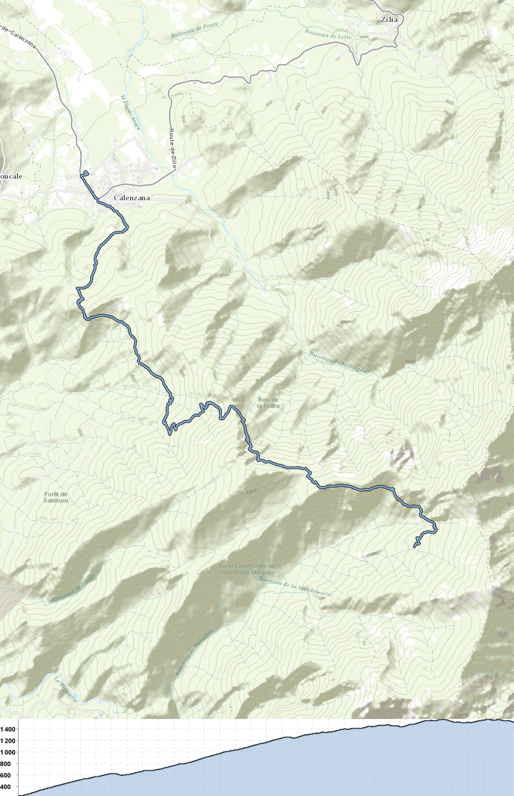

# GPX to map

[](https://github.com/gpx-to-map/gpx-to-map-core/javadoc/)

This library can be used to generate batches of nice maps from GPX files.

## Quickstart

### Maven

Add the dependency to your pom.xml :

```xml

<dependency>
    <groupId>io.github.ibethus.gpxtomap</groupId>
    <artifactId>gpx-to-map</artifactId>
    <version>1.4.0</version>
</dependency>
```

### Usage

**Given folders with gpx files :**

```
📦my_folder
 ┣ 📂sub_folder
 ┃ ┗ 📜another_gpx.gpx
 ┗ 📜my_gpx.gpx
```

**This is the base configuration for a running gpxToMapWalker :**

```java
DefaultGpxMapper defaultGpxMapper = new DefaultGpxMapper.builder().build();
var gpxToMapWalker = new GpxToMapWalker.builder<>()
        .setGpxFileRunner(new DefaultGpxRunner(defaultGpxMapper))
        .build();

// When you run it, it will create a nice PNG for each GPX file :
Files.walkFileTree("my_folder/",gpxToMapWalker);
```

**Result :**

```
📦my_folder
 ┣ 📂sub_folder
 ┃ ┣ 📜another_gpx.gpx
 ┃ ┗ 📜another_gpx.png
 ┣ 📜my_gpx.gpx
 ┗ 📜my_gpx.png
```

If a folder contains subfolders, a map representing all the GPX files found in the subfolder can be generated by using
the `shouldUpdateParentFolder` while builder the `GpxToMapWalker` object.

## Maps

Maps are created using [this fork](https://github.com/JMapCreator/StaticMap) of
the [StaticMap](https://github.com/doubotis/StaticMap) project.

### Result

The default settings will product something similar to this :



## Contributions

If you want to contribute, please open issues, or fork the repo and open PRs. I will happily answer/review them !

## TODOs

* Not much configuration can be done for now -> to be improved (color, size, tile provider, etc.)
* Use TestContainer for ITs